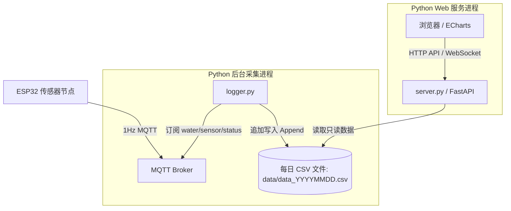

# water_logger 传感器高频数据记录与动态曲线分析工具设计文档

## 1. 目标描述
本项目是一个本地运行的 Python 数据记录与可视化工具，主要用于接收并持久化保存污水自动采样系统中 MDC04 水位传感器的高频数据（周期为 1s 一条数据），并提供一个直观、炫酷且交互方便的 Web 页面来检查电容变化曲线与有水/无水状态转换。

由于硬件只负责上报原始物理电容值，所有的滤波、环境基准线自适应追踪以及双向施密特触发器判断逻辑都需要在 Python 后端重新实现一次，并支持在 Web 端动态调参、即时演算。

## 2. 系统架构设计 (双进程隔离)
为保证长时间连续采集数据（1周至1个月）的绝对稳定性，避免 Web 端查询或开发重启影响数据采集，系统采用**双进程物理隔离架构**。

### 2.1 数据采集器 (`logger.py`)
* **网络与连接**：基于 `paho-mqtt` 库订阅 `water/sensor/status`。
* **数据流向**：
  - 提取 JSON 中的 `sensor1`, `sensor2`, `sensor3` 以及 `state` 状态字节。
  - 获取本地当前时间，写入对应的 `data/data_YYYYMMDD.csv`。
  - 追加写入的格式为：
    `timestamp,sensor1,sensor2,sensor3,mqtt_state`
* **并发写安全**：作为唯一的写入端，采用追加写模式，杜绝锁竞争。

### 2.2 Web 服务器 (`server.py`)
* **框架选择**：基于 `FastAPI` (Python 3.8+)。
* **API 接口**：
  - `/api/history`：提供历史数据查询，支持传入调参参数（MA窗口、基准线窗口、门限偏移量），返回计算后的曲线数组。
  - `/api/realtime`：实时监测，或展示最近一段时期的原始曲线。
* **并发读安全**：以共享只读模式打开 CSV 文件进行流式解析，并发安全。

---

## 3. 本地算法实现 (`sensor_logic.py`)
完美复刻 ESP32 端 `Sensor.cpp` 的 C++ 状态机算法。

### 3.1 核心公式与逻辑
1. **滑动均值滤波器 (MA Filter)**：
   - 窗口大小 $W_{ma}$（默认 50）。
   - 公式：$F_t = \frac{1}{W_{ma}} \sum_{i=0}^{W_{ma}-1} R_{t-i}$（其中 $R$ 为原始电容值，$F$ 为滤波值）。
2. **慢速环境基准线追踪 (Baseline Tracker)**：
   - 窗口大小 $W_{base}$（默认 200）。
   - 输入为已滤波的值 $F_t$。
   - 公式：$B_t = \frac{1}{W_{base}} \sum_{i=0}^{W_{base}-1} F_{t-i}$（其中 $B$ 为环境基准线）。
3. **迟滞比较器 / 施密特双向触发器**：
   - 门限偏移量 $\Delta$（默认 50，对应 0.50pF）。
   - 若当前状态为 **`NO_WATER` (DRY, 0)**，判定门限为：$T = B_t + \Delta$。若 $F_t > T$，跳转至 `HAS_WATER` 状态。
   - 若当前状态为 **`HAS_WATER` (WET, 1)**，判定门限为：$T = B_t - \Delta$。若 $F_t < T$，跳转至 `NO_WATER` 状态。
4. **有水看门狗 (WDT)**：
   - 若物理通道持续处于 `HAS_WATER` 状态达到 5 小时（按时间戳差值计算），强制将其复位为 `NO_WATER`，清空计时器，防挂死。

---

## 5. 前端 Web UI 设计 (Sleek Dark Mode)
* **视觉设计**：
  - **主题**：深色科技风 (`#0B0F19`)，毛玻璃卡片（`backdrop-filter`）。
  - **字体**：引入 `Inter` 或 `Outfit` 字体。
* **ECharts 曲线渲染**：
  - 原始曲线：细灰色线，低透明度。
  - 滤波曲线：粗高亮青色/翡翠绿实线。
  - 基准线：橙黄色实线。
  - 触发门限线：半透明黄色虚线（随状态上下跳变）。
  - 有水覆盖背景：图表下方通过 ECharts `markArea` 将有水时段标出淡绿色背景。
* **大数量渲染与交互**：
  - 开启 `large: true` 提高 8 万个点以上的数据渲染性能。
  - 开启 `sampling: 'lttb'` 降采样，防止缩放卡顿并完美保留峰值细节。
  - 支持 `dataZoom` 时间轴自由缩放、拖拽与多通道曲线隐藏/显示。
* **调参交互**：
  - 包含滑块，支持在网页端拖动修改 MA窗口、基准线窗口与门限偏移量，点击“重算”即刻刷新图表。
